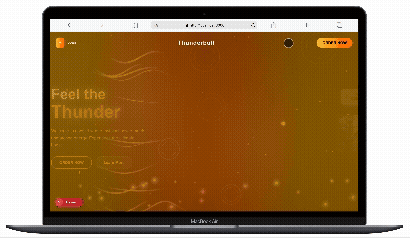

<!-- Use this file to provide workspace-specific custom instructions to Copilot. For more details, visit https://code.visualstudio.com/docs/copilot/copilot-customization#_use-a-githubcopilotinstructionsmd-file -->

# Thunderbull Landing Page Project

> **Project Demo Video**  
>   
> 
>
> _Click the images above to watch the demo video or view the animated GIF._

This is a Next.js project featuring an animated energy drink landing page with:

- Smooth entrance animations on page load
- Continuous background lightning effects
- Interactive mouse tracking
- Canvas-based particle systems
- Energy burst animations
- 3D perspective effects on the product can

## Key Technologies:

- Next.js 15 with App Router
- Tailwind CSS for styling
- Custom Canvas animations for lightning effects
- React hooks for state management and animations

## Project Structure:

- `app/page.tsx` - Main page that renders ThunderbullLanding
- `app/components/ThunderbullLanding.jsx` - Main animated landing page component
- `public/frame_1.png` - Product can image

## Animation Features:

- Lightning bolt canvas animations
- Energy burst particles on page load
- Mouse-tracking parallax effects
- Staggered text and element animations
- 3D hover effects on the product can
